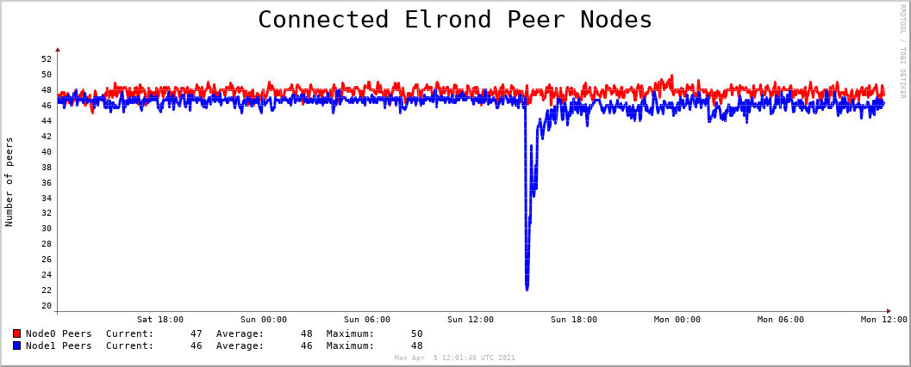
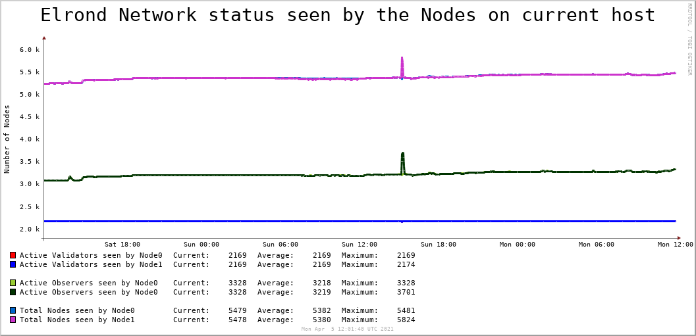
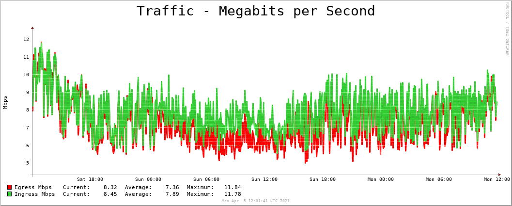

# elrond-monitor
Monitoring and reporting the health status of an Elrond node
This is a stateless solution to record & report the health status of an Elrond Network node and the host machine it is installed on.
It is built as a collection of scripts meant to run periodically via Crontab and take complete snapshots of various data points on the system, which are then stored as Data Sources in a Round-Robin Database.

The Data Sources are then periodically picked up from the RRD, plotted as a graph and sent to a a custom email address: a very simple form of daily Node health status reporting.


## Script Components

### 01_create_RRD_db.sh ###
- this script creates a RRD database pre-populated with all data sources we need in order to create system-wide health snapshots (60sec interval) for an Elrond node
- the script takes a single argument, which is the full system path of the RRD database

### 02_create_RRD_db_API.sh ### 
- this script creates a RRD database pre-populated with data sources where we will record Elrond API information for one or more Elrond nodes
- since this information is sourced from the Elrond API, this offers a global view of our node's contribution to the Elrond Network
- the script takes a single argument, which is the full system path of the RRD database

### 03_periodic_data_collector.sh ### 
- This script is collecting multiple data points for all physical and logical components of an Elrond Validator Node
- It's scraping the output of a few standard linux commands 
- Its aim is to create a snapshot of a node's health status everytime the script runs
- The snapshot is saved in a Round-Robin Db (RRD), because of low footprint, (lack of) management requirements and risk of memory leaks
- The script was built to be executed every 60s and thus must consume as few resources as possible
- It's also written as simple as possible, so it can be understood & troubleshot fast when required 

### 04_periodic_data_collector_elrond_api.sh ### 
- This script is grabbing the complete validator listing from the main Elrond API gateway and extracting information relevant for the current Node
- Its aim is to create a snapshot of a node's health status, as seen by the Elrond network
- The snapshot is saved in a Round-Robin Db (RRD), because of low footprint, (lack of) management requirements, stateless nature and risk of memory leaks
- The script was built to be executed every ~ 300s or more, to avoid stressing the API gateway
- It's also written as simple as possible, so it can be understood & troubleshot fast when required 

### 05_generate_graphs.sh ### 
- This script is generating the Node health status graphs we care about, based on the values we have in our Node RRD
- It is storing the graphs in a custom folder, from where we will pick them up later and email them to ourselves

### 06_generate_graphs_api.sh ### 
- This script also is generating graphs but only for data we've collected from the Elrond API, based on the values we have in our API RRD
- It is storing the graphs in a custom folder, from where we will pick them up later and email them to ourselves

### 07_email_reports.sh ### 
- This script simply invokes mutt to send an email with all files found in the GRAPHS_FOLDER. This is where we've stored the graphs generated by RRDTOOL in the previous step(s).
- The example I've put in this script uses a pre-configured Gmail account to send the message to my personal email. Feel free to change to whatever you need.


## Install ##
### STEP 1 ###  
Install all dependencies, see bottom of this page.
Create a custom email address to use when sending periodic health reports.
Clone this repository in your Elrond home directory.

### STEP 2 ###
Set the executable flag on all .sh files
`chmod +x elrond-monitor/*sh`

### STEP 3 ###
Generate the Node status Round-Robin DB:
`./elrond-monitor/create_rrd_db.sh /home/user/database.rrd`

### STEP 4 ### 
Generate the API status Round-Robin DB:
`./elrond-monitor/create_rrd_db.sh /home/user/database_api.rrd`

### STEP 5 ### 
Customize the scripts with your own system's details:
- Customize script `02_create_RRD_db_API.sh` with the number of nodes you want to monitor / graph. This script assumes you will be monitoring exactly TWO nodes, so if you want more / less you'll have to go throuygh the script and adjust it as well.
- Customize script `03_periodic_data_collector.sh` with the `PRODUCTION_INTERFACE`,`RRD_LOCATION` and `ELROND_USER_HOME_FOLDER` variables
- Customize script `04_periodic_data_collector_elrond_api.sh` with the `RRD_LOCATION` and the `ELROND_NODE_x_BLS` keys for all servers you want to monitor. This script assumes you will be monitoring exactly TWO nodes, so if you want more / less you'll have to go throuygh the script and adjust it as well.
- Customize script `05_generate_graphs.sh` with the `RRD_LOCATION` and `GRAPHS_LOCATION` variables.
- Customize script `06_generate_graphs_api.sh` with the `RRD_LOCATION` and `GRAPHS_LOCATION` variables. This script assumes you will be creating graphs for exactly TWO nodes, so if you want more / less you'll have to go throuygh the script and adjust it as well.
- Customize script `07_email_reports.sh` with the `HOSTNAME`,`GRAPHS_FOLDER`, and `EMAIL` variables

### STEP 6 ### 
Add the scripts to crontab - `crontab -e`
- The `03_periodic_data_collector.sh` script will be executed every minute
- The `04_periodic_data_collector_elrond_api.sh` script will be executed every 5 minutes
- The `05_generate_graphs.sh` script will be executed at 05:00 AM UTC every morning
- The `06_generate_graphs_api.sh` script will be executed at 05:00 AM UTC every morning as well
- The `07_email_reports.sh` script will be executed at 05:01 AM UTC every morning 

Paste in these lines into crontab, adjusting for your Elrond user $HOME folder of course:
```
* * * * * /home/user/elrond-monitor/03_periodic_data_collector.sh >/dev/null 2>&1
*/5 * * * * /home/user/elrond-monitor/04_periodic_data_collector_elrond_api.sh >/dev/null 2>&1
0 5 * * * /home/user/elrond-monitor/05_generate_graphs.sh >/dev/null 2>&1
0 5 * * * /home/user/elrond-monitor/06_generate_graphs_api.sh >/dev/null 2>&1
1 5 * * * /home/user/elrond-monitor/07_email_reports.sh >/dev/null 2>&1
```

### STEP 7 ### 
Configure MUTT to send you automatic emails. For this you will need to create a `.muttrc` file in your Elrond user home folder.
Here is how my `/home/user/.muttrc` file looks like. For this example I've used a Gmail address.
```
set from = "<elrond health reporter gmail user>@gmail.com"
set realname = "<Email Sender Name>"
set smtp_url = "smtp://<elrond health reporter gmail user>@smtp.gmail.com:587/"
set smtp_pass = "<elrond health reporter gmail password>"
```


### Dependencies ###
sysstat smartmontools rrdtool mutt

### Assumptions ###
The scripts are all written in Bash and assume they are executed on a Baremetal Server (BMS) running Ubuntu 18.04.
They have been tested on a BMS with:
- 8-core Intel Xeon E3-1230v6 CPU
- 32GB RAM
- 2 x 2TB SATA hard-disks in a RAID1 configuration

## Example graphs created by this solution ##
Here are a few examples from a server that runs TWO nodes. 
They all have a big title and thick lines, so they are rendered well on a mobile phone screen.





